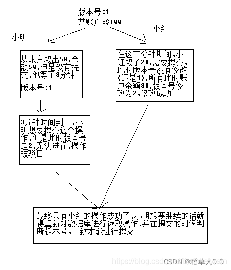

# MyBatis plus

官网：[MyBatis-Plus](https://www.mybatis-plus.com/) 

为简化开发而生

## 1、MyBatis-plus是什么？

### 1.1、简介

MyBatis 本来就是简化 JDBC 操作的。MyBatis-plus 则是简化 MyBatis。

[MyBatis-Plus](https://github.com/baomidou/mybatis-plus)（简称 MP）是一个 [MyBatis](https://www.mybatis.org/mybatis-3/) 的增强工具，在 MyBatis 的基础上只做增强不做改变，为简化开发、提高效率而生。

​	

### 1.2、特性

- **无侵入**：只做增强不做改变，引入它不会对现有工程产生影响，如丝般顺滑
- **损耗小**：启动即会自动注入基本 CURD，性能基本无损耗，直接面向对象操作（BaseMapper）
- **强大的 CRUD 操作**：内置通用 Mapper、通用 Service，仅仅通过少量配置即可实现单表大部分 CRUD 操作，更有强大的条件构造器，满足各类使用需求(以后简单的CRUD操作不用自己编写了!)
- **支持 Lambda 形式调用**：通过 Lambda 表达式，方便的编写各类查询条件，无需再担心字段写错
- **支持主键自动生成**：支持多达 4 种主键策略（内含分布式唯一 ID 生成器 - Sequence），可自由配置，完美解决主键问题
- **支持 ActiveRecord 模式**：支持 ActiveRecord 形式调用，实体类只需继承 Model 类即可进行强大的 CRUD 操作
- **支持自定义全局通用操作**：支持全局通用方法注入（ Write once, use anywhere ）
- **内置代码生成器**：采用代码或者 Maven 插件可快速生成 Mapper 、 Model 、 Service 、 Controller 层代码，支持模板引擎，更有超多自定义配置等您来使用(自动帮你生成代码)
- **内置分页插件**：基于 MyBatis 物理分页，开发者无需关心具体操作，配置好插件之后，写分页等同于普通 List 查询
- **分页插件支持多种数据库**：支持 MySQL、MariaDB、Oracle、DB2、H2、HSQL、SQLite、Postgre、SQLServer 等多种数据库
- **内置性能分析插件**：可输出 SQL 语句以及其执行时间，建议开发测试时启用该功能，能快速揪出慢查询
- **内置全局拦截插件**：提供全表 delete 、 update 操作智能分析阻断，也可自定义拦截规则，预防误操作


## 2、快速入门

[快速开始 | MyBatis-Plus](https://www.mybatis-plus.com/guide/quick-start.html#初始化工程)

使用第三方组件：

​	1、导入对应的依赖

​	2、研究依赖如何配置

​	3、代码如何编写

​	4、提高扩展技术能力

### 2.1、初始化数据库

----

重装了win 11系统得重装软件：

[MySQL的详细安装教程 - 知乎 (zhihu.com)](https://zhuanlan.zhihu.com/p/188416607)

[MySQL安装配置教程（超级详细、保姆级）_mb623f210f81d2d的技术博客_51CTO博客](https://blog.51cto.com/u_15571262/5167008)

[Navicat Premium 15安装教程(完整激活版) - 云+社区 - 腾讯云 (tencent.com)](https://cloud.tencent.com/developer/article/1804255)

-----

创建数据库 mybatis_plus：

```sql
CREATE DATABASE `mybatis_plus` CHARACTER SET 'utf8' COLLATE 'utf8_general_ci';
```

创建数据表 user：

```sql
DROP TABLE IF EXISTS user;

CREATE TABLE user
(
	id BIGINT(20) NOT NULL COMMENT '主键ID',
	name VARCHAR(30) NULL DEFAULT NULL COMMENT '姓名',
	age INT(11) NULL DEFAULT NULL COMMENT '年龄',
	email VARCHAR(50) NULL DEFAULT NULL COMMENT '邮箱',
	PRIMARY KEY (id)
);
-- 真实的开发中，还有一些字段version（乐观锁）、删除逻辑（delete）、创建/更新时间（create/update_time）、创建/更新用户（create/update_user）
```

初始化数据：

```sql
DELETE FROM user;

INSERT INTO user (id, name, age, email) VALUES
(1, 'Jone', 18, 'test1@baomidou.com'),
(2, 'Jack', 20, 'test2@baomidou.com'),
(3, 'Tom', 28, 'test3@baomidou.com'),
(4, 'Sandy', 21, 'test4@baomidou.com'),
(5, 'Billie', 24, 'test5@baomidou.com');
```

### 2.2、初始化项目

使用springboot初始化项目

> 导入依赖：

```xml
<!-- 数据库驱动 -->
<dependency>
    <groupId>mysql</groupId>
    <artifactId>mysql-connector-java</artifactId>
</dependency>
<!-- 导入mybatis-plus 是自己开发的，并非官方的！-->
<!-- https://mvnrepository.com/artifact/com.baomidou/mybatis-plus-boot-starter -->
<dependency>
    <groupId>com.baomidou</groupId>
    <artifactId>mybatis-plus-boot-starter</artifactId>
    <version>3.5.1</version>
</dependency>
```

**说明：使用 MyBatis-Plus 可以节省我们大量的代码，尽量不要同时导入 MyBatis 和 MyBatis-Plus ！**


> 连接数据库

与 Mybatis 配置一样

MySQL 5 和 MySQL 8 的驱动不同，MySQL 8 需要增加时区的配置。

```properties
# mysql 5  驱动不同 com.mysql.jdbc.Driver
spring.datasource.username=root
spring.datasource.password=root
spring.datasource.url=jdbc:mysql://localhost:3306/mybatis_plus?useUnicode=true&characterEncoding=UTF-8&serverTimezone=Asia/Shanghai
spring.datasource.driver-class-name=com.mysql.cj.jdbc.Driver

# mysql 8 驱动不同 com.mysql.cj.jdbc.Driver 增加时区的配置: &serverTimezone=Asia/Shanghai
```


> 编写代码

**传统方式：**pojo ==> dao(配置Mybatis, 配置 mapper.xml 文件) ==> service ==>controller

**Mybatis-Plus 方式：**pojo ==> mapper ==> 使用


创建 pojo 类

```java
/**
 * @desc
 * @auth llp
 * @date 2022年06月12日 23:25
 */
public class User {
        private Long id;
        private String name;
        private Integer age;
        private String email;
        
}
```

编写Mapper类

```java
/**
 * @desc 在对应的 Mapper类上继承基本的类 BaseMapper<T>
 * @auth llp
 * @date 2022年06月12日 23:28
 */
@Repository // 代表持久层
public interface UserMapper extends BaseMapper<User> {
    // 所有的 CRUD 操作已经编写完成了
    // 你不需要像以前一样配置一大堆文件了
}
```

在 Spring Boot 启动类中添加 `@MapperScan` 注解，扫描 Mapper 文件夹：

```java
@SpringBootApplication
@MapperScan("com.example.mapper")       // 扫描 mapper 文件夹
public class MybatisPlusApplication {
	....
}
```

### 2.3、开始使用

使用springboot测试类，进行功能测试：

```java
@SpringBootTest
class MybatisPlusApplicationTests {

    // 继承了 BaseMapper，所有的方法都来自父类
    // 我们也可以自己扩展方法
    @Autowired
    private UserMapper userMapper;

    @Test
    void contextLoads() {
        List<User> userList = userMapper.selectList(null);
        userList.forEach(System.out::println);
    }
}
```

### 2.4、思考问题

1、SQL 谁帮我们写的？ Mybatis-Plus

2、方法哪里来的？Mybatis-Plus 都写好了，我们直接使用即可


## 3、配置日志

我们所有的SQL现在是不可见的，我们希望知道它是怎么执行的，所以我们必须要查看日志。

```properties
# 日志配置
# 默认的控制台输出
mybatis-plus.configuration.log-impl=org.apache.ibatis.logging.stdout.StdOutImpl
```

配置完之后就可以在控制台查看SQL的日志输出：


## 4、CRUD 扩展

### 4.1、Insert

```java
// 测试插入
@Test
public void testInsert(){
    User user = new User();
    user.setName("面包");
    user.setAge(24);
    user.setEmail("843818747@qq.com");

    // 自动生成ID，返回受影响的行数
    int result = userMapper.insert(user);
    System.out.println(result);
    // 发现ID会自动回填
    System.out.println(user);
}
```


数据库插入的ID的默认值为：全局的唯一ID

#### **主键生成策略**

[分布式系统唯一ID生成方案汇总 - nick hao - 博客园 (cnblogs.com)](https://www.cnblogs.com/haoxinyue/p/5208136.html)

**雪花算法：**

snowflake是Twitter开源的分布式ID生成算法，**结果是一个long型的ID。**其核心思想是：使用41bit作为毫秒数，10bit作为机器的ID（5个bit是数据中心，5个bit的机器ID），12bit作为毫秒内的流水号（意味着每个节点在每毫秒可以产生 4096 个 ID），最后还有一个符号位，永远是0。


```java
@TableId(type = IdType.INPUT)

public enum IdType {
    AUTO(0),		// 主键使用数据库ID自增策略
    NONE(1),		// 未设置主键
    INPUT(2),		// 手动输入
    ASSIGN_ID(3),	// 主键生成策略使用雪花算法
    ASSIGN_UUID(4);	// 主键生成策略为不含中划线的UUID
}
```

> 自增策略 AUTO

需要配置的主键自增：

1、实体类字段加上注解 `@TableId(type = IdType.AUTO)`

2、数据库字段一定要自增

> 手动输入 INPUT

**主键生成策略使用INPUT，就必须自己配置ID**

支持父类定义@KeySequence子类继承使用

内置支持：

- DB2KeyGenerator
- H2KeyGenerator
- KingbaseKeyGenerator
- OracleKeyGenerator
- PostgreKeyGenerator

如果内置支持不满足你的需求，可实现 **IKeyGenerator** 接口来进行扩展.

```java
@KeySequence(value = "SEQ_ORACLE_STRING_KEY", clazz = String.class)
public class YourEntity {
    @TableId(value = "ID_STR", type = IdType.INPUT)
    private String idStr;
}
```

需要在 ORACLE 数据库中创建序列

```sql
-- 创建序列
CREATE SEQUENCE SEQ_ORACLE_STRING_KEY START WITH 1 INCREMENT BY 1
```

> **Spring-Boot**

**[#](https://www.mybatis-plus.com/guide/sequence.html#方式一-使用配置类)方式一：使用配置类**

```java
@Bean
public IKeyGenerator keyGenerator() {
    return new H2KeyGenerator();
}
```

**[#](https://www.mybatis-plus.com/guide/sequence.html#方式二-通过mybatispluspropertiescustomizer自定义)方式二：通过MybatisPlusPropertiesCustomizer自定义**

```java
@Bean
public MybatisPlusPropertiesCustomizer plusPropertiesCustomizer() {
    return plusProperties -> plusProperties.getGlobalConfig().getDbConfig().setKeyGenerator(new H2KeyGenerator());
}
```

> **Spring**

**[#](https://www.mybatis-plus.com/guide/sequence.html#方式一-xml配置)方式一: XML配置**

```xml
<bean id="globalConfig" class="com.baomidou.mybatisplus.core.config.GlobalConfig">
   <property name="dbConfig" ref="dbConfig"/>
</bean>

<bean id="dbConfig" class="com.baomidou.mybatisplus.core.config.GlobalConfig.DbConfig">
   <property name="keyGenerator" ref="keyGenerator"/>
</bean>

<bean id="keyGenerator" class="com.baomidou.mybatisplus.extension.incrementer.H2KeyGenerator"/>
```

**[#](https://www.mybatis-plus.com/guide/sequence.html#方式二-注解配置)方式二：注解配置**

```java
@Bean
public GlobalConfig globalConfig() {
	GlobalConfig conf = new GlobalConfig();
	conf.setDbConfig(new GlobalConfig.DbConfig().setKeyGenerator(new H2KeyGenerator()));
	return conf;
}
```

> 详情

[Sequence主键 | MyBatis-Plus](https://www.mybatis-plus.com/guide/sequence.html)

[自定义ID生成器 | MyBatis-Plus](https://www.mybatis-plus.com/guide/id-generator.html#spring-boot)


### 4.2、Update

```java
// 测试更新
@Test
public void testUpdate(){
    User user = new User();
    // 通过条件自动拼接动态SQL
    user.setId(6L);
    user.setName("更新面包");
    user.setAge(18);

    // 注意：updateById 参数是一个对象
    int result = userMapper.updateById(user);
    System.out.println(result);
    // 发现ID会自动回填
    System.out.println(user);
}
```


所有的SQL都是自动帮你配置的


#### 自动填充功能

[自动填充功能 | MyBatis-Plus](https://www.mybatis-plus.com/guide/auto-fill-metainfo.html)

创建时间、修改时间！这些操作一遍是自动化完成的，我们不希望手动更新！

所有的表至少必备的字段：create_time、modify_time、is_delete。需要自动化。

> **方式一：数据库级别 （工作中不允许你修改数据库，不建议使用）** 

**1、新增 create_time、modify_time 字段的 SQL 语句：**

```sql
alter table `user` add `create_time` datetime default CURRENT_TIMESTAMP comment '创建时间';
alter table `user` add `update_time` datetime default CURRENT_TIMESTAMP on UPDATE CURRENT_TIMESTAMP comment '更新时间';
```

**2、再次测试插入方法，我们需要先把实体类同步**

User 添加字段

 ```java
 private Date createTime;
 private Date updateTime;
 ```

**3、再次运行更新测试**


> **方式二：代码级别**

**1、删除数据库的默认值、更新操作**

```sql
ALTER TABLE `mybatis_plus`.`user` 
MODIFY COLUMN `create_time` datetime(0) NULL COMMENT '创建时间' AFTER `email`,
MODIFY COLUMN `update_time` datetime(0) NULL COMMENT '更新时间' AFTER `create_time`;
```

**2、实体类的字段上需要增加注解**

```java
@TableField(.. fill = FieldFill.INSERT)

public enum FieldFill {
    DEFAULT,		// 默认不处理
    INSERT,			// 插入填充字段
    UPDATE,			// 更新填充字段
    INSERT_UPDATE	// 插入和更新填充字段
}
```

更改如下：

```java
@TableField(fill = FieldFill.INSERT)
private Date createTime;
@TableField(fill = FieldFill.INSERT_UPDATE)
private Date updateTime;
```

**3、实现元对象处理器接口：com.baomidou.mybatisplus.core.handlers.MetaObjectHandler**

```java
@Slf4j
@Component
public class MyMetaObjectHandler implements MetaObjectHandler {

    @Override
    public void insertFill(MetaObject metaObject) {
        log.info("start insert fill ....");
        this.strictInsertFill(metaObject, "createTime", LocalDateTime.class, LocalDateTime.now()); // 起始版本 3.3.0(推荐使用)
        // 或者
        this.strictInsertFill(metaObject, "createTime", () -> LocalDateTime.now(), LocalDateTime.class); // 起始版本 3.3.3(推荐)
        // 或者
        this.fillStrategy(metaObject, "createTime", LocalDateTime.now()); // 也可以使用(3.3.0 该方法有bug)
    }

    @Override
    public void updateFill(MetaObject metaObject) {
        log.info("start update fill ....");
        this.strictUpdateFill(metaObject, "updateTime", LocalDateTime.class, LocalDateTime.now()); // 起始版本 3.3.0(推荐)
        // 或者
        this.strictUpdateFill(metaObject, "updateTime", () -> LocalDateTime.now(), LocalDateTime.class); // 起始版本 3.3.3(推荐)
        // 或者
        this.fillStrategy(metaObject, "updateTime", LocalDateTime.now()); // 也可以使用(3.3.0 该方法有bug)
    }
}
```

实现自己的注解处理器类：

```java
/**
 * @desc
 * @auth llp
 * @date 2022年06月13日 23:38
 */
@Slf4j
@Component      // 一定不要忘记把处理器加到 IOC 容器中！！！
public class MyMetaObjectHandler implements MetaObjectHandler {
    // 插入时的填充策略
    @Override
    public void insertFill(MetaObject metaObject) {
        log.info("start insert fill ....");
        // setFieldValByName(String fieldName, Object fieldVal, MetaObject metaObject)
        this.setFieldValByName("createTime", new Date(), metaObject);
        this.setFieldValByName("updateTime", new Date(), metaObject);

        // strictInsertFill(MetaObject metaObject, String fieldName, Class<T> fieldType, E fieldVal)
        // 字段类型为: LocalDateTime 如：private LocalDateTime createTime;
        // this.strictInsertFill(metaObject, "createTime",  LocalDateTime.class, LocalDateTime.now());
        // this.strictInsertFill(metaObject, "updateTime",  LocalDateTime.class, LocalDateTime.now());
    }
    // 更新时的填充策略
    @Override
    public void updateFill(MetaObject metaObject) {
        log.info("start update fill ....");
        this.setFieldValByName("updateTime", new Date(), metaObject);
        // this.strictInsertFill(metaObject, "updateTime",  LocalDateTime.class, LocalDateTime.now());
    }
}
```

**4、测试插入、更新。观察数据库数据！**

---

注意事项：

- 填充原理是直接给`entity`的属性设置值!!!
- 注解则是指定该属性在对应情况下必有值,如果无值则入库会是`null`
- `MetaObjectHandler`提供的默认方法的策略均为:如果属性有值则不覆盖,如果填充值为`null`则不填充
- 字段必须声明`TableField`注解,属性`fill`选择对应策略,该声明告知`Mybatis-Plus`需要预留注入`SQL`字段
- 填充处理器`MyMetaObjectHandler`在 Spring Boot 中需要声明`@Component`或`@Bean`注入
- 要想根据注解`FieldFill.xxx`和`字段名`以及`字段类型`来区分必须使用父类的`strictInsertFill`或者`strictUpdateFill`方法
- 不需要根据任何来区分可以使用父类的`fillStrategy`方法

### 4.3、Select

```java
// 查询测试
@Test
public void testSelect1(){
    User user = userMapper.selectById(1L);
    System.out.println(user);
}
// 测试批量查询
@Test
public void testSelect2(){
    List<User> users = userMapper.selectBatchIds(Arrays.asList(1, 2, 3));
    users.forEach(System.out::println);
}
// 测试条件查询之一：map
@Test
public void testSelect3(){
    HashMap<String, Object> map = new HashMap<>();
    // 自定义要查询的条件
    map.put("name", "面包");
    map.put("age", 24);
    List<User> users = userMapper.selectByMap(map);
    users.forEach(System.out::println);
}
```


### 4.4、delete

```java
// 根据 entity 条件，删除记录
int delete(@Param(Constants.WRAPPER) Wrapper<T> wrapper);
// 删除（根据ID 批量删除）
int deleteBatchIds(@Param(Constants.COLLECTION) Collection<? extends Serializable> idList);
// 根据 ID 删除
int deleteById(Serializable id);
// 根据 columnMap 条件，删除记录
int deleteByMap(@Param(Constants.COLUMN_MAP) Map<String, Object> columnMap);
```

#### 逻辑删除

>物理删除：从数据库中直接删除
>
>逻辑删除：在数据库中的数据没有没删除，而是通过变量来让他失效。如：del_flag 字段：0表示未删除，1表示已删除

管理员可以查看被删除的记录，防止数据丢失。类似于回收站。

[逻辑删除 | MyBatis-Plus](https://www.mybatis-plus.com/guide/logic-delete.html#使用方法)

**说明:**

只对自动注入的sql起效:

- 插入: 不作限制
- 查找: 追加where条件过滤掉已删除数据,且使用 wrapper.entity 生成的where条件会忽略该字段
- 更新: 追加where条件防止更新到已删除数据,且使用 wrapper.entity 生成的where条件会忽略该字段
- 删除: 转变为 更新

**例如:**

- 删除: `update user set deleted=1 where id = 1 and deleted=0`
- 查找: `select id,name,deleted from user where deleted=0`

**字段类型支持说明:**

- 支持所有数据类型(推荐使用 `Integer`,`Boolean`,`LocalDateTime`)
- 如果数据库字段使用`datetime`,逻辑未删除值和已删除值支持配置为字符串`null`,另一个值支持配置为函数来获取值如`now()`

**附录:**

- 逻辑删除是为了方便数据恢复和保护数据本身价值等等的一种方案，但实际就是删除。
- 如果你需要频繁查出来看就不应使用逻辑删除，而是以一个状态去表示。

#### 常见问题:

**[#](https://www.mybatis-plus.com/guide/logic-delete.html#_1-如何-insert)1. 如何 insert ?**

1. 字段在数据库定义默认值(推荐)

2. insert 前自己 set 值

3. 使用自动填充功能

**[#](https://www.mybatis-plus.com/guide/logic-delete.html#_2-删除接口自动填充功能失效)2. 删除接口自动填充功能失效**

1. 使用 `update` 方法并: `UpdateWrapper.set(column, value)`(推荐)

2. 使用 `update` 方法并: `UpdateWrapper.setSql("column=value")`

3. 使用[Sql注入器](https://www.mybatis-plus.com/guide/sql-injector.html)注入`com.baomidou.mybatisplus.extension.injector.methods.LogicDeleteByIdWithFill`并使用(推荐)

> 测试

1、在数据库中增加字段

```sql
ALTER TABLE `mybatis_plus`.`user` 
MODIFY COLUMN `deleted` int(1) NULL DEFAULT 0 COMMENT '逻辑删除：0 表示未删除，1 表示已删除' AFTER `update_time`;
```

2、配置文件

```yml
mybatis-plus:
  global-config:
    db-config:
      logic-delete-field: flag  # 全局逻辑删除的实体字段名(since 3.3.0,配置后可以忽略不配置步骤2)
      logic-delete-value: 1 	# 逻辑已删除值(默认为 1)
      logic-not-delete-value: 0 # 逻辑未删除值(默认为 0)
```

2、实体类中增加属性

```java
@TableLogic     // 逻辑删除
private Integer delFlag;
```

4、测试

```java
// 测试逻辑删除
@Test
public void testLogicDelete(){
    userMapper.deleteById(1L);
}
```


## 5、插件

### 5.1、插件主体

[插件主体(必看!)(since 3.4.0) | MyBatis-Plus](https://www.mybatis-plus.com/guide/interceptor.html#mybatisplusinterceptor)

**MybatisPlusInterceptor**

该插件是核心插件,目前代理了 `Executor#query` 和 `Executor#update` 和 `StatementHandler#prepare` 方法

**[#](https://www.mybatis-plus.com/guide/interceptor.html#属性)属性**

> ```java
> private List<InnerInterceptor> interceptors = new ArrayList<>();
> ```

**[#](https://www.mybatis-plus.com/guide/interceptor.html#innerinterceptor)InnerInterceptor**

我们提供的插件都将基于此接口来实现功能

目前已有的功能:

- 自动分页: PaginationInnerInterceptor
- 多租户: TenantLineInnerInterceptor
- 动态表名: DynamicTableNameInnerInterceptor
- 乐观锁: OptimisticLockerInnerInterceptor
- sql性能规范: IllegalSQLInnerInterceptor
- 防止全表更新与删除: BlockAttackInnerInterceptor

**注意**

使用多个功能需要注意顺序关系,建议使用如下顺序

- 多租户,动态表名
- 分页,乐观锁
- sql性能规范,防止全表更新与删除

**总结:** 

对sql进行单次改造的优先放入,不对sql进行改造的最后放入


### 5.2、乐观锁

总是认为不会产生并发问题，每次去取数据的时候总认为不会有其他线程对数据进行修改，因此不会上锁，但是在更新时会判断其他线程在这之前有没有对数据进行修改，一般会使用版本号机制或CAS操作实现。

乐观锁（Optimistic Lock），顾名思义，就是很乐观，每次去拿数据的时候都认为别人不会修改，所以不会上锁，但是在提交更新的时候会判断一下在此期间别人有没有去更新这个数据。乐观锁适用于读多写少的应用场景，这样可以提高吞吐量。

乐观锁：假设不会发生并发冲突，只在提交操作时检查是否违反数据完整性。

乐观锁一般来说有以下2种方式：

> **数据版本（Version）**

使用**数据版本（Version）记录机制**实现，这是乐观锁最常用的一种实现方式。何谓数据版本？即为数据增加一个版本标识，一般是通过为数据库表增加一个数字类型的 “version” 字段来实现。当读取数据时，将version字段的值一同读出，数据每更新一次，对此version值加一。当我们提交更新的时候，判断数据库表对应记录的当前版本信息与第一次取出来的version值进行比对，如果数据库表当前版本号与第一次取出来的version值相等，则予以更新，否则认为是过期数据。

> **时间戳（timestamp）**

使用**时间戳（timestamp**）。乐观锁定的第二种实现方式和第一种差不多，同样是在需要乐观锁控制的table中增加一个字段，名称无所谓，字段类型使用时间戳（timestamp）, 和上面的version类似，也是在更新提交的时候检查当前数据库中数据的时间戳和自己更新前取到的时间戳进行对比，如果一致则OK，否则就是版本冲突。



---

[乐观锁 | MyBatis-Plus](https://www.mybatis-plus.com/guide/interceptor-optimistic-locker.html)

**OptimisticLockerInnerInterceptor**

当要更新一条记录的时候，希望这条记录没有被别人更新

乐观锁实现方式：

- 取出记录时，获取当前version

- 更新时，带上这个version

- 执行更新时， set version = newVersion where version = oldVersion

- 如果version不对，就更新失败


> 测试

**1、给数据库中增加 `version` 字段**

```sql
ALTER TABLE `mybatis_plus`.`user` 
ADD COLUMN `version` int(10) NULL DEFAULT 1 COMMENT '乐观锁' AFTER `email`;
```

**2、实体类修改**

在实体类的字段上加上`@Version`注解

```java
@Version
private Integer version;
```

**3、配置插件**

```java
/**
 * @desc
 * @auth llp
 * @date 2022年06月14日 23:13
 */
@MapperScan("com.example.mapper")       // 扫描 mapper 文件夹
@EnableTransactionManagement
@Configuration
public class MyBatisPlusConfig {
    // 注册乐观锁插件
    @Bean
    public MybatisPlusInterceptor mybatisPlusInterceptor() {
        MybatisPlusInterceptor interceptor = new MybatisPlusInterceptor();
        interceptor.addInnerInterceptor(new OptimisticLockerInnerInterceptor());
        return interceptor;
    }
}
```

**4、测试乐观锁**

```java
// 测试乐观锁 成功
@Test
public void testVersionSuccess(){
    // 1、查询用户信息
    User user = userMapper.selectById(1L);
    // 2、修改信息
    user.setName("面包");
    user.setEmail("843818747@qq.com");
    // 3、执行更新操作
    userMapper.updateById(user);
}

// 测试乐观锁 失败 多线程下
@Test
public void testVersionFail(){
    // 线程1
    User user1 = userMapper.selectById(1L);
    user1.setName("面包11111");
    user1.setEmail("843818747@qq.com");

    // 模拟另一个线程执行插队操作 ======
    User user2 = userMapper.selectById(1L);
    user2.setName("面包22222");
    user2.setEmail("843818747@qq.com");
    userMapper.updateById(user2);
    // =============================
    // 没有乐观锁就会覆盖插队线程的值
    userMapper.updateById(user1);
}
```


### 5.3、分页插件

分页在网站使用的十分之多

1、 原始的 limit 分页

2、pageHelper 第三方插件

3、MyBatis-Plus 也内置了分页插件


> 分页插件

[分页插件 | MyBatis-Plus](https://www.mybatis-plus.com/guide/page.html)

[分页 | MyBatis-Plus](https://www.mybatis-plus.com/guide/interceptor-pagination.html#paginationinnerinterceptor)

**1、配置类配置拦截器**

```java
/**
 * @desc
 * @auth llp
 * @date 2022年06月14日 23:13
 */
@MapperScan("com.example.mapper")       // 扫描 mapper 文件夹
@EnableTransactionManagement
@Configuration
public class MyBatisPlusConfig {
    // 配置拦截器
    @Bean
    public MybatisPlusInterceptor mybatisPlusInterceptor() {
        MybatisPlusInterceptor interceptor = new MybatisPlusInterceptor();
        // 分页插件
        interceptor.addInnerInterceptor(new PaginationInnerInterceptor(DbType.MYSQL));
        // 乐观锁插件
        interceptor.addInnerInterceptor(new OptimisticLockerInnerInterceptor());
        return interceptor;
    }
}
```

**2、直接使用Page对象**

  ```java
  // 测试分页查询
  @Test
  public void testPage(){
      // 参数一：当前页
      // 参数二：页面大小 size
      Page<User> page = new Page<>(1, 5);
      userMapper.selectPage(page, null);
  
      page.getRecords().forEach(System.out::println); // 获取分页后的数据
      System.out.println(page.getPages());            // 一共多少页
      System.out.println(page.getTotal());            // 一共多少条记录
      System.out.println(page.getCurrent());          // 当前页
  }
  ```


## 6、性能分析插件

[执行 SQL 分析打印 | MyBatis-Plus](https://www.mybatis-plus.com/guide/p6spy.html)

**该功能依赖 `p6spy` 组件，完美的输出打印 SQL 及执行时长 `3.1.0` 以上版本**

1、**导入依赖**

```xml
<!-- https://mvnrepository.com/artifact/p6spy/p6spy -->
<dependency>
    <groupId>p6spy</groupId>
    <artifactId>p6spy</artifactId>
    <version>3.9.1</version>
</dependency>
```

**2、修改 `application.properties` 配置**

```properties
spring.datasource.url=jdbc:p6spy://localhost:3306/mybatis_plus?useUnicode=true&characterEncoding=UTF-8&serverTimezone=Asia/Shanghai
spring.datasource.driver-class-name=com.p6spy.engine.spy.P6SpyDriver
```

**3、`spy.properties` 配置**

```properties
#3.2.1以上使用
modulelist=com.baomidou.mybatisplus.extension.p6spy.MybatisPlusLogFactory,com.p6spy.engine.outage.P6OutageFactory
#3.2.1以下使用或者不配置
#modulelist=com.p6spy.engine.logging.P6LogFactory,com.p6spy.engine.outage.P6OutageFactory
# 自定义日志打印
logMessageFormat=com.baomidou.mybatisplus.extension.p6spy.P6SpyLogger
#日志输出到控制台
appender=com.baomidou.mybatisplus.extension.p6spy.StdoutLogger
# 使用日志系统记录 sql
#appender=com.p6spy.engine.spy.appender.Slf4JLogger
# 设置 p6spy driver 代理
deregisterdrivers=true
# 取消JDBC URL前缀
useprefix=true
# 配置记录 Log 例外,可去掉的结果集有error,info,batch,debug,statement,commit,rollback,result,resultset.
excludecategories=info,debug,result,commit,resultset
# 日期格式
dateformat=yyyy-MM-dd HH:mm:ss
# 实际驱动可多个
#driverlist=org.h2.Driver
# 是否开启慢SQL记录
outagedetection=true
# 慢SQL记录标准 2 秒
outagedetectioninterval=2
```

**4、测试**


> **注意！**

- driver-class-name 为 p6spy 提供的驱动类
- url 前缀为 jdbc:p6spy 跟着冒号为对应数据库连接地址
- 打印出sql为null,在excludecategories增加commit
- 批量操作不打印sql,去除excludecategories中的batch
- 批量操作打印重复的问题请使用MybatisPlusLogFactory (3.2.1新增）
- 该插件有性能损耗，不建议生产环境使用。


## 7、条件构造器（重点）

[条件构造器 | MyBatis-Plus](https://www.mybatis-plus.com/guide/wrapper.html)

==**警告:**==

不支持以及不赞成在 RPC 调用中把 Wrapper 进行传输

1. wrapper 很重
2. 传输 wrapper 可以类比为你的 controller 用 map 接收值(开发一时爽,维护火葬场)
3. 正确的 RPC 调用姿势是写一个 DTO 进行传输,被调用方再根据 DTO 执行相应的操作


## 8、代码生产器

[代码生成器（历史版本） | MyBatis-Plus](https://www.mybatis-plus.com/guide/generator.html#使用教程)

[代码生成器（3.5.1+版本） | MyBatis-Plus](https://www.mybatis-plus.com/guide/generator-new.html)

> 测试

导入依赖

```xml
<!-- https://mvnrepository.com/artifact/com.baomidou/mybatis-plus-generator -->
<dependency>
    <groupId>com.baomidou</groupId>
    <artifactId>mybatis-plus-generator</artifactId>
    <version>3.5.2</version>
</dependency>
<!-- https://mvnrepository.com/artifact/org.apache.velocity/velocity-engine-core -->
<dependency>
    <groupId>org.apache.velocity</groupId>
    <artifactId>velocity-engine-core</artifactId>
    <version>2.3</version>
</dependency>
<!-- https://mvnrepository.com/artifact/io.swagger/swagger-annotations -->
<dependency>
    <groupId>io.swagger</groupId>
    <artifactId>swagger-annotations</artifactId>
    <version>1.6.5</version>
</dependency>
```

测试代码

```java
/**
 * @desc 代码自动生成器
 * @auth llp
 * @date 2022年06月16日 22:55
 */
public class AutoCodeConfig {
    public static void main(String[] args) {
        // 数据库配置
        DataSourceConfig dataSourceConfig = new DataSourceConfig.
                Builder("jdbc:p6spy:mysql://localhost:3306/mybatis_plus?useUnicode=true&characterEncoding=UTF-8&serverTimezone=Asia/Shanghai",
                "root",
                "root")
                .build();

        // 需要构建一个 代码自动生成器 对象
        AutoGenerator generator = new AutoGenerator(dataSourceConfig);
        // 全局配置
        String projectPath = System.getProperty("user.dir");
        GlobalConfig globalConfig = new GlobalConfig.Builder()
                .outputDir(projectPath + "/src/main/java")
                .disableOpenDir()
                .author("面包")
                .enableSwagger()
                .dateType(DateType.TIME_PACK)
                .commentDate("yyyy-MM-dd")
                .build();
        generator.global(globalConfig);

        // 包配置
        PackageConfig packageConfig = new PackageConfig.Builder()
                .parent("com.mianbao.mybatisplus.samples.generator")
                .moduleName("test")
                .entity("entity")
                .service("service")
                .serviceImpl("service.impl")
                .mapper("mapper")
                .xml("mapper.xml")
                .controller("controller")
                .other("other")
                .pathInfo(Collections.singletonMap(OutputFile.xml, projectPath + "/src/resources/mapper"))
                .build();
        generator.packageInfo(packageConfig);

        // 模板配置
        TemplateConfig templateConfig = new TemplateConfig.Builder()
                .disable(TemplateType.ENTITY)
                .entity("/templates/entity.java")
                .service("/templates/service.java")
                .serviceImpl("/templates/serviceImpl.java")
                .mapper("/templates/mapper.java")
                .xml("/templates/mapper.xml")
                .controller("/templates/controller.java")
                .build();
        generator.template(templateConfig);

        // 注入配置
//        InjectionConfig injectionConfig = new InjectionConfig.Builder()
//                .beforeOutputFile((tableInfo, objectMap) -> {
//                    System.out.println("tableInfo: " + tableInfo.getEntityName() + " objectMap: " + objectMap.size());
//                })
//                .customMap(Collections.singletonMap("test", "mianbao"))
//                .customFile(Collections.singletonMap("test.txt", "/templates/test.vm"))
//                .build();
//        generator.injection(injectionConfig);

        // 策略配置
        new StrategyConfig.Builder()
                .enableCapitalMode()
                .enableSkipView()
                .disableSqlFilter()
//                .likeTable(new LikeTable("USER"))
                .addInclude("user")     // 设置要映射的表
//                .addTablePrefix("t_", "c_")
//                .addFieldSuffix("_flag")
                .build();

        // Entity策略配置
        StrategyConfig strategyConfig = new StrategyConfig.Builder()
                .entityBuilder()
                //.superClass(BaseEntity.class)
                .disableSerialVersionUID()
                .enableChainModel()
                .enableLombok()
                .enableRemoveIsPrefix()
                .enableTableFieldAnnotation()
                .enableActiveRecord()
                .versionColumnName("version")
                .versionPropertyName("version")
                .logicDeleteColumnName("deleted")
                .logicDeletePropertyName("deleteFlag")
                .naming(NamingStrategy.no_change)
                .columnNaming(NamingStrategy.underline_to_camel)
                .addSuperEntityColumns("id", "created_by", "created_time", "updated_by", "updated_time")
                .addIgnoreColumns("age")
                .addTableFills(new Column("create_time", FieldFill.INSERT))
                .addTableFills(new Property("updateTime", FieldFill.INSERT_UPDATE))
                .idType(IdType.AUTO)
                .formatFileName("%sEntity")

        // Controller策略配置
                .controllerBuilder()
                // .superClass(BaseController.class)
                .enableHyphenStyle()
                .enableRestStyle()
                .formatFileName("%sAction")

        // Service策略配置
                .serviceBuilder()
                // .superServiceClass(BaseService.class)
                // .superServiceImplClass(BaseServiceImpl.class)
                .formatServiceFileName("%sService")
                .formatServiceImplFileName("%sServiceImp")

        // Mapper策略配置
                .mapperBuilder()
                // .superClass(BaseMapper.class)
                .enableMapperAnnotation()
                .enableBaseResultMap()
                .enableBaseColumnList()
                // .cache(MyMapperCache.class)
                .formatMapperFileName("%sDao")
                .formatXmlFileName("%sXml")
                .build();
        generator.strategy(strategyConfig);

        generator.execute();
    }
}
```


